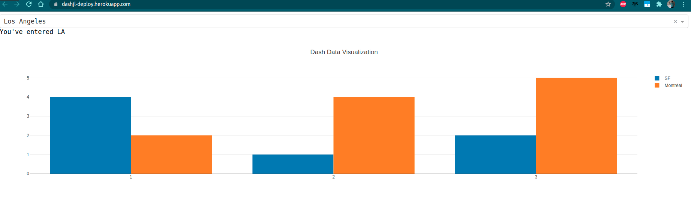

# dash-deploy

## Development server

```sh
julia --project=. app.jl
```

## Deployment

Initialize Heroku, add files to Git, and deploy

```sh
$ heroku create dashjl-deploy --buildpack https://github.com/Optomatica/heroku-buildpack-julia # change my-dash-app to a unique name    
$ git add . # add all files to git
$ git commit -m 'Initial app boilerplate'
$ git push heroku main # deploy code to Heroku
$ heroku ps:scale web=1  # run the app with one Heroku 'dyno'
```
You should be able to access your app at [`https://dashjl-deploy.herokuapp.com`](https://dashjl-deploy.herokuapp.com).

Update the code and redeploy

When you modify `app.jl` with your own code, you will need to add the changes to git and push those changes to heroku.

```sh
$ git status # view the changes
$ git add .  # add all the changes
$ git commit -m 'a description of the changes'
$ git push heroku main
```

## Preview

The app is deployed at [`https://dashjl-deploy.herokuapp.com`](https://dashjl-deploy.herokuapp.com).

